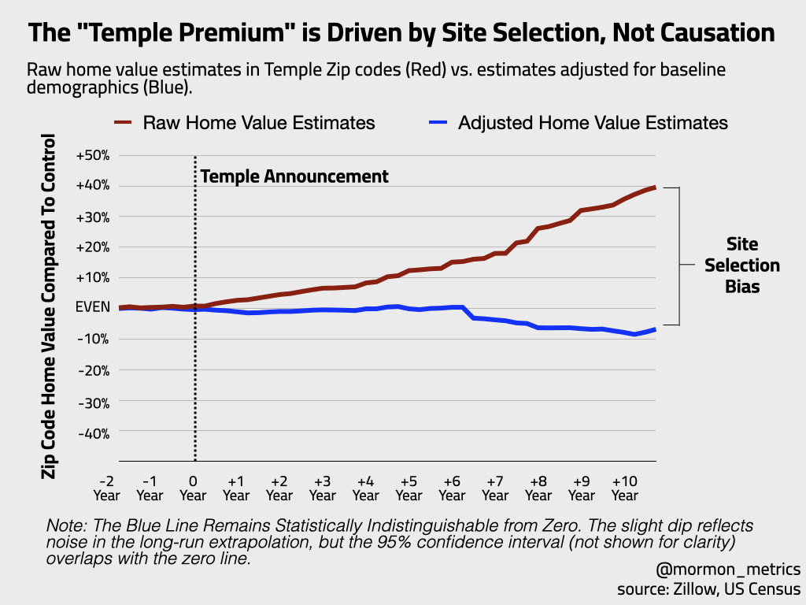
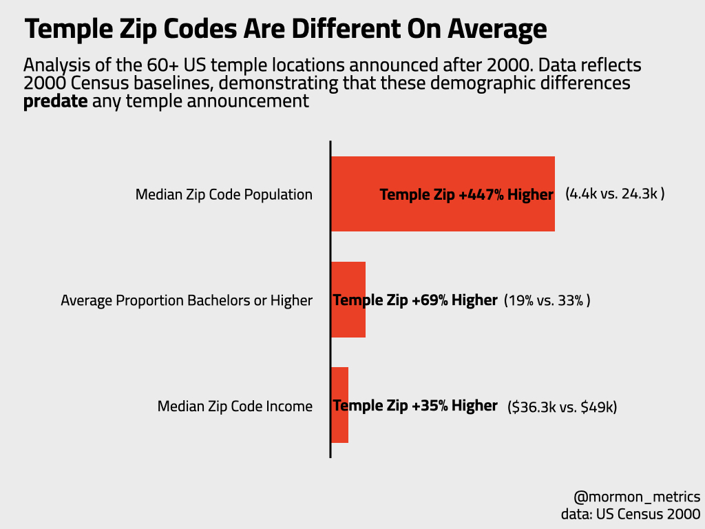

\newpage
\tableofcontents
\newpage

# Executive Summary

**The Question:** For decades, a common belief in the Intermountain West real estate market has been that the announcement of a Latter-day Saint temple guarantees a significant spike in neighboring property values. Real estate agents often cite a "Temple Premium" of 10–20%, pitching temple sites as sure-fire investment opportunities. This report investigates whether that premium is a causal result of the temple itself, or a statistical illusion.

**The Analysis:** We conducted a rigorous econometric analysis of 42 temple locations announced across the United States since 2011. Using a Staggered Difference-in-Differences (DiD) framework on 15 years of Zillow housing data, we isolated the price impact of the temple from broader regional market trends.

{width=70% fig-align="center"}

**Key Findings:** 

* The Premium is Real, But Misleading: In raw data, temple neighborhoods do outperform the national average, often trading at a 22% premium. 
* The Cause is Selection, Not the Temple itself: This premium disappears when controlling for pre-existing demographic trends. Our analysis shows that the Church systematically selects sites in zip codes that are 35% wealthier, 69% more educated, and 447% more populous than the average zip code before the announcement is made.
* The "Null" Result: After adjusting for these baseline advantages, the causal impact of a temple announcement on home values is statistically indistinguishable from zero (-2.6%, $p > 0.05$) though notably, we do not have the power to detect an effect of 5% or less (so a smaller effect is possible).

**Conclusion:** The "Temple Premium" is driven by selection bias. The Church does not build temples in random areas that subsequently boom; it identifies neighborhoods that are already "winning" and places infrastructure there.

\newpage

# Introduction

When The Church of Jesus Christ of Latter-day Saints announces a new temple, the local reaction is instant and deeply polarized.

On one side, real estate agents and faithful investors see dollar signs. They circulate the folklore of the "Temple Premium"—a belief that the arrival of a temple acts as a divine anchor, guaranteeing that neighboring home values will skyrocket by 10% to 20%. To them, the temple is the ultimate amenity.

On the other side, concerned residents and "Not In My Backyard" (NIMBY) groups foresee a crisis. They argue that the increased traffic, 100-foot steeples, and the floodlights will turn their quiet streets into commercial zones, rendering their homes "unmarketable" and dragging property values down.

This report contains bad news for both groups.

We conducted the largest-ever econometric analysis of temple housing markets, analyzing 15 years of Zillow housing data across 42 temple locations announced since 2011. Using a Staggered Difference-in-Differences model, we tested whether temples act as a rocket ship for prices (as the faithful hope) or an anchor (as the critics fear).

The results are decidedly unsatisfying for the ideologues on both sides:

To the Critics: There is no evidence that temples destroy property values at least at the community/neighborhood level. While immediate neighbors may experience localized nuisance effects, our data confirms these are not severe enough to drag down the broader zip code.

To the Faithful: There is no causal evidence that temples create wealth. Once you control for the pre-existing momentum of the neighborhood, the "Temple Premium" vanishes compared to the model without controls. As noted in the executive summary, a more modest premium of 5% or less is still possible. We just rule out more than that.

As Tooele, Utah, realtor Chris Sloan wisely asked KUTV News regarding the massive appreciation near the Deseret Peak Temple: ["In some cases where we’ve seen explosive growth, the question is: What came first? The temple or the growth?"](https://kutv.com/news/local/will-new-temple-increase-home-values-in-tooele-county-experts-say-maybe)

Our analysis supports that the growth comes first.

The data reveals that the "Temple Premium" is likely mostly an illusion of Site Selection Bias. The Church does not build in declining areas to save them, nor does it build in random areas that subsequently boom. It systematically selects neighborhoods that are already wealthier, more educated, and more populous than the national average.

In short: The Church doesn't create the real estate wave. It surfs it.

The wave is *real* — prices in these areas do go up — but the temple is just another passenger on the ride, likely not the engine driving it.

\newpage

# Methodology (in plain english)

## What We Did

If you check home prices in a neighborhood five years after a temple is announced, they will almost certainly be higher than they were before. Real estate agents see this and say, "See? The temple raised values."

But that is bad math. Correlation is not causation. In the last decade, home values went up everywhere. To find the true impact of the temple, we have to answer a difficult question: "What would these homes be worth today *if the temple had never been announced*?"

**Our Approach:** Staggered Difference-in-Differences
We used a modern statistical framework designed for "rolling rollouts." Since temples aren't all announced on the same day, we treat every announcement as its own experiment.

We compared every "Temple Neighborhood" to a pool of "Control Neighborhoods" (areas that had not yet received a temple). But we didn't just compare their raw prices.

The "Fair Fight" Adjustment (Regression Adjustment)
Comparison is unfair if the groups are different. As our data showed, Temple Neighborhoods start out wealthier, more educated, and more populous than the average neighborhood. They are "born" with a head start.

To fix this, we used a technique called Outcome Regression Adjustment.

**The Inputs:** We fed the model the "Baseline DNA" of every neighborhood from the year 2000 and before any temple in our dataset was announced: income levels, population density, homeownership rates, share of households with kids, education levels, and the percentage of the county that is LDS.

**The Prediction:** The model used this DNA to calculate a "Predicted Growth Path" for the temple neighborhoods as if the temple didn't exist.

**The Result:** We then compared the actual home prices to this predicted path.

If the actual price shoots above the predicted path after the announcement, the temple caused the value. If the actual price follows the predicted path perfectly, then the growth was caused by the demographic "DNA," not the temple.

## Limitations and Robustness

1. Geographic Granularity (The "Neighborhood vs. Neighbor" Distinction)

The Limitation: This study utilizes Zip Code Tabulation Areas (ZCTAs) as the primary unit of analysis. We acknowledge that Zip Codes are aggregate units that smooth over hyper-local variance. **Consequently, this model measures the "Macro-Amenity" effect (the impact on the broader community) rather than the "Micro-Effect" (the impact on the homes directly abutting the property).**

The Defense: This granularity matches the scope of the "Temple Premium" folklore, which posits a neighborhood-wide lift in value (10-20%), not merely a benefit for the few dozen homes sharing a property line. If the temple were truly a "rising tide that lifts all boats," that signal would be mathematically detectable in the Zip Code aggregate. Its absence is significant.

Addressing Nuisance Effects: Critics may argue that a negative "Nuisance Effect" (traffic/lighting) on immediate neighbors is being washed out by the broader Zip Code data. While possible, for a Zip Code average to remain effectively zero (as our data shows) while immediate neighbors suffer a crash, the non-abutting homes would have to experience a simultaneous, offsetting boom. We find no theoretical basis for such a perfect cancellation. It is more statistically probable that the net impact is neutral across both scales.

2. Treatment Spillovers (The "Neighbor" Problem)

The Limitation: Standard Difference-in-Differences models assume SUTVA (Stable Unit Treatment Value Assumption)—essentially, that the "Control" group is completely unaffected by the treatment. However, if a Control Zip Code is right next to a Temple Zip Code, it might also enjoy a price bump from the new amenity.

The Risk: If the Control group also goes up in value (due to proximity), the difference between the two groups shrinks, biasing our result toward zero.

The Defense: To mitigate this, we selected control zips from the broader region rather than exclusively adjacent neighborhoods. However, to the extent that positive spillovers exist across zip code boundaries, our estimates should be interpreted as a conservative lower bound of the true effect. Though the fact that we see no causal effect even in low-density, isolated markets (Model 3) suggests that treatment spillovers are not masking a true premium.

3. The "Insider Trading" Lag (Anticipatory Effects)

The Limitation: We treat the public "Announcement Date" as the start of the treatment. However, developers and well-connected land owners could know about site selection months or years in advance. Other times the site is not yet picked out.

The Risk: Prices may have started rising before our official "Day 0," meaning our model attributes that growth to "Pre-Trend" demographics rather than the temple itself.

The Defense: Our event-study plots (Figure 5) allow us to visually inspect the pre-announcement period. We found no statistically significant 'pre-loading' of prices in the 12 months prior to announcement, suggesting that information leakage was not a primary driver of price appreciation in these markets.

4. County-Level Religious Data

The Limitation: While we have highly granular data for income and housing, the Latter-day Saint population share is only available at the County level (via the U.S. Religion Census).

The Risk: We are assuming that every Zip Code in a county has the same religious density. In reality, a temple might be built in a specific "LDS Enclave" zip code within a less-LDS county. Our model might under-control for the specific "religious density" of the immediate neighborhood.

The Defense: This is a constraint of available U.S. religious census data. However, given that Percent LDS is highly correlated with other granular variables we did control for (such as Percent of household with at least one child), the model likely captures the 'LDS Demographic Profile' via these proxies even where the specific religious count is coarse.

5. The "Frozen DNA" Lag (Census 2000 Baselines)

The Limitation: Our regression models utilize demographic baselines (income, education, LDS share) from the 2000 Census to generate counterfactuals for temple announcements occurring post-2010. We acknowledge that neighborhoods can evolve significantly over a 10-15 year period, and this "lagged" data may not perfectly reflect the neighborhood's status at the exact moment of announcement.

The Defense: This lag was a deliberate design choice to ensure Strict Exogeneity. In real estate econometrics, using control data from the year immediately preceding an announcement (e.g., 2014 data for a 2015 announcement) risks introducing bias, as the variables may already reflect speculative developer activity or "insider trading" in anticipation of the project. By anchoring our controls to the year 2000, we measure the neighborhood’s fundamental "long-run trajectory" free from any anticipatory contamination related to the temple itself.

\newpage

# Where Are Temples Built?

To understand why temple neighborhoods outperform the market, we first have to ask: How does the Church choose a location?

One theory of temple building suggests a "Missionary Model"—that temples are built in "frontier" areas to gather new members or revitalize struggling communities. If this were true, we would expect to see temples appear in average or even underserved neighborhoods.

The data reveals the opposite.

Our analysis of Census records for 80 temple sites compared to the national averages establishes a clear "Winner’s Profile." The Church systematically selects neighborhoods that are already winning economicly years before the announcement is made.

{width=70% fig-align="center"}

The "Selection Bias" Formula
As shown in Figure 2, the demographic gap between a "Temple Zip Code" and a "Control Zip Code" is not a margin of error; it is a canyon.

**Decoding the Data**

1. **They Follow the "Creative Class"** The single strongest predictor of future real estate appreciation is education levels. As established by urban economists like [Glaeser (2004)](https://fedinprint.org/item/fedpwp/3909/original) and [Moretti (2013)](https://escholarship.org/uc/item/9883047j), areas with high concentrations of college-educated residents experience a 'Human Capital Multiplier,' seeing faster wage growth and property appreciation than the national average. Temple zip codes boast a population where nearly 1 in 3 adults holds a bachelor's degree, compared to less than 1 in 5 in the control group. In real estate economics, this indicates a "high-human-capital" area—neighborhoods that attract tech jobs, high-end retail, and stability.

2. **They Avoid the Frontier Contrary to the "Missionary Model"** Temples are less likely to be built in sparse or developing frontiers. The average temple zip code is 4.5x more populous than the US overall. The Church is not building out to the people; it is building in to more established population centers.

3. **The "Tithing Base" Reality** While critics argue the Church builds to convert, the data suggests they build to serve. The average proportion of LDS per county metric shows that temples are placed in counties that are already 22.6% Latter-day Saint, compared to just 1.7% in the control group. This could suggest that temples are "Reward Infrastructure" for established tithing bases, ensuring the asset will be highly utilized immediately upon opening.

\newpage

# What Is The Impact Of Temples On Home Prices?

If you ask a casual observer whether temples increase home values, the answer appears obvious. In raw dollar terms, homes in temple zip codes perform exceptionally well.

Figure 3 (below) tracks the price trajectory of temple neighborhoods relative to the control group. The red line represents the unadjusted, raw market data—the numbers that real estate agents and homeowners actually see in their Zillow estimates.

If you ask a casual observer whether temples increase home values, the answer appears obvious. In raw dollar terms, homes in temple zip codes perform exceptionally well.

{width=70% fig-align="center"}

Figure 3 tracks the price trajectory of temple neighborhoods relative to the control group. The red line represents the unadjusted, raw market data—the numbers that real estate agents and homeowners actually see in their Zillow estimates.

As the red line demonstrates, temple zip codes do not just beat the market; they crush it.The "Rocket Ship" Effect: Immediately following the announcement, the raw premium begins a steady, upward march.

Our unadjusted model (Model 1) confirms a statistically significant "Temple Premium" of 21.9% ($p < 0.05$). If this were the only model we ran, it would validate the folklore entirely. A 22% jump is exactly what real estate agents promise.

However, as established in the previous section, we know these neighborhoods were already wealthier (by 35%) and more educated (by 69%) than the control group before the temple was even announced. To find the true impact of the temple itself, we must strip away these pre-existing advantages (The Causal Effect: Model 2). 

The blue line in Figure 1 represents the Causal Effect—the change in price that remains after we use our regression model to control for the "Winner's Profile." The result is a collapse of the premium. Once we account for the demographics, the causal impact of the temple announcement drops to -2.6%. 

This result is statistically indistinguishable from zero ($p > 0.05$).**"But could there still be a small premium?"** Skeptics might argue that our model is too strict, or that a smaller premium exists hidden in the noise. To address this, we examined the 95% Confidence Interval of our estimate. This interval represents the range of "mathematically plausible" outcomes given the data. 

Lower Bound: -10.5%   
Upper Bound: +5.3%

This finding is critical. While we cannot statistically rule out a small positive effect (up to 5.3%), we can definitively rule out the massive 10–20% spikes promised by the folklore. Even in the most optimistic statistical scenario, at least 75% of the observed appreciation in temple neighborhoods is driven by Selection Bias (demographics), not the temple itself. In summary, The "Temple Premium" is not a real estate phenomenon; it is a selection phenomenon. The Church on average picks places that see future growth, but it is not the engine creating it.

\newpage

# Does The Impact Change In Dense LDS Areas Vs Sparse Ones?

A common critique of national real estate studies is that they average out cultural nuances.

Economically, a temple is a "polarizing amenity."

In "Zion" (Utah/Idaho): It is a highly desirable asset. A significant portion of the population holds a temple recommend and values a short commute for worship and weddings. Here, we would expect the "Temple Premium" to be real.

In the "Mission Field" (e.g., Boston/New York): It is often viewed as a "disamenity." Residents may view it not as a holy site, but as a commercial-scale structure that brings traffic and lighting to residential zones. Here, critics argue, the impact should be negative.

To test this, we experimented with 3 breaks based on the religious density of the county: Sparse (<5% LDS), Moderate (>5% LDS), and Dense (>30% LDS).

![Note: This chart compares the causal price impact in "Mission Field" counties (<5% LDS population) versus "Zion" counties (>30% LDS population). While the high-density areas (Right) show a slightly higher directional coefficient (+1.7%) than low-density areas (+0.4%), both results are statistically indistinguishable from zero. The 95% Confidence Intervals (error bars) for both groups cross the zero line, indicating that even in markets where the temple is a highly utilized amenity, it does not independently drive property appreciation](./images/images.002.jpeg){width=70% fig-align="center"}

If the "Temple Premium" exists anywhere, it should be in counties where over 30% of the population is Latter-day Saint (e.g., Utah, Eastern Idaho). This is the "Best Case Scenario" for the believer's hypothesis—demand for the amenity is highest here.

And what we find is even in these high-density strongholds, the causal effect remains statistically indistinguishable from zero. While the model (Model 5) detects a slight directional bump of +1.7%, the result is drowned out by the noise (Confidence Interval: -5.7% to +9.1%). Even in neighborhoods where the temple is culturally beloved, it does not act as a statistically significant independent driver of appreciation. The high prices in these areas are driven by the fact that they are wealthy suburbs of Salt Lake City or Boise, not because of the steeple.

Conversely, counties with less than 5% LDS population represent the "Worst Case Scenario." These are the areas where temple announcements frequently face lawsuits and protests (e.g., Cody, WY; Harrison, NY) over fears of property devaluation. What we find is the "NIMBY" fears are unfounded, at least at a community level (houses immediately bordering we cannot say). The causal impact in these areas is 0.4% — effectively zero. Temples do not likely crash property values in non-LDS neighborhoods. The "nuisance effects" of traffic or lighting are either negligible at the community level or perhaps are offset by the improvement in neighborhood aesthetics (landscaping, infrastructure).

Whether in a county that is 2% LDS or 80% LDS, the fundamental drivers of home value remain the same: income, education, and population growth.

In Low-LDS areas, they pick the wealthy, educated suburb (the "Winner's Profile").

In High-LDS areas, they pick the wealthy, educated suburb.

Because the selection criteria are consistent, the result is consistent: The neighborhood appreciates because of who lives there, not because of the building itself.

**But look at the point estimates, there is a directional shift!**

While the "Temple Premium" remains statistically insignificant across all models, a closer examination of the coefficients reveals a distinct divergence in market behavior based on religious density.

In markets with low LDS populations (<5%), the causal effect is effectively zero (+0.4%). This suggests that to the average non-member, the temple is economically neutral—it acts neither as a nuisance to be avoided nor a luxury amenity to be chased. It is simply part of the background scenery.

However, in "Zion" markets (counties with >30% LDS population), the model detects a noticeable directional shift, with the coefficient rising to +1.7%. While this finding remains within the margin of error, the increased magnitude suggests that Cultural Utility is attempting to price itself into the market.

Economically, this directional lift likely reflects the difference between a Passive Amenity and an Active Necessity.

In the Mission Field (e.g., Hartford, CT): The temple functions as a "Passive Amenity"—like a botanical garden. Neighbors enjoy the view, but they do not use the building.

In Zion (e.g., Layton, UT): The temple acts as a "Club Good." A significant percentage of the buyer pool holds a temple recommend and intends to visit the site frequently. For these buyers, proximity reduces the transaction costs of worship (commute time). In these markets, the temple is not just a view; it is a functional utility, similar to a good school or a commuter train station.

If the demand is so high in Utah, why isn't the premium statistically significant? The answer could lie in Saturation.

In the early 20th century, living near a temple was a rare privilege. Today, the Wasatch Front is so densely populated with temples (Salt Lake, Draper, Oquirrh Mountain, Jordan River, Taylorsville, etc.) that "temple proximity" has lost its scarcity for some regions.

The Scarcity Principle: A homebuyer does not need to pay a 10% premium to live near a temple when almost every suburb in the Salt Lake Valley is now within a 15-minute drive of one.

Conclusion: The positive directional signal in high-LDS areas could suggest that members do value proximity, acting as a "tie-breaker" when choosing between similar homes. However, the saturation of temples in these regions may ensure that this preference never hardens into a measurable financial premium. The amenity may be too abundant to be expensive.

\newpage

# Implications

## Investors + Home Buyers

For real estate investors, these findings suggest that a strategy based solely on acquiring property immediately following a temple announcement may yield limited excess returns. Because our data indicates that the observed price appreciation in these areas is largely driven by pre-existing demographic trends rather than the announcement itself, the "premium" appears to be priced in well before the Church publicizes its plans. The rapid appreciation often observed in these zip codes likely reflects the momentum of underlying economic fundamentals—such as income levels and population density—that were already in motion. Therefore, investors seeking capitalization rates similar to those found in temple neighborhoods might be better served by identifying markets that exhibit these specific demographic markers (e.g., high educational attainment and family density) rather than waiting for a specific institutional development to confirm the area's potential.

For residential homebuyers, this analysis offers a nuanced perspective on the high costs often associated with temple neighborhoods. While prices in these areas are indeed higher than the national average, the evidence suggests this valuation is perhaps a reflection of established community amenities—such as school quality, safety, and neighborhood stability—rather than a speculative bubble driven by the temple itself. Buyers paying a premium in these zones are likely paying for the tangible economic characteristics of the neighborhood, not a unique "temple effect." Consequently, while these homes appear to be stable investments that retain value, buyers should not necessarily expect the arrival of the temple to trigger a new, independent wave of appreciation beyond what the local market's demographics would otherwise dictate.

Finally, for residents concerned about the potential negative externalities of new construction, the data provides no evidence to support the fear that temples depress local property values. Even in markets where the non-LDS population is dominant and sensitivity to new development is high, our model detects no statistically significant negative impact on housing prices following a temple announcement. This suggests that any potential localized inconveniences, such as increased traffic or lighting, could be balanced by the capitalization of the new landscaping, infrastructure improvements, and the general maintenance of the site. The absence of a negative price signal implies that the market views the temple as a neutral neighbor rather than a disamenity. However, our confidence intervals indicate that if there is negative impact it would be less than 10%, so a price impact is still possible.

## Urban Planners + Economists

For urban planners and municipal zoning boards, these findings provide a quantitative framework for evaluating the frequent contention that large-scale religious developments function as residential disamenities. Opposition to temple construction is frequently grounded in the concern that the scale of the edifice, combined with potential increases in traffic and lighting, will render adjacent properties less desirable, thereby eroding the local tax base. Our analysis, however, finds little empirical support for this claim. The absence of a statistically significant negative price shock—even in low-density, non-LDS markets where sensitivity to such changes would presumably be highest—suggests that the perceived negative externalities are likely less severe than anticipated or are sufficiently offset by the positive externalities of the site, such as high-quality landscaping and low-decibel operations. Consequently, arguments predicated on the inevitability of property devaluation may need to be weighed cautiously against this historical data during the permitting process.

For economists, this study contributes to the broader literature on amenity capitalization and neighborhood sorting. The apparent "Temple Premium" observed in raw data appears to be a textbook example of selection bias rather than a causal treatment effect. The strong correlation between temple locations and high-human-capital indicators—specifically educational attainment and household income—suggests that the Church acts as a rational agent, optimizing for site utilization by locating near established populations of fiscally stable members. This dynamic illustrates that religious amenities often follow demographic shifts rather than catalyzing them. Thus, the elevated home prices observed in these zones should be interpreted primarily as a signal of the neighborhood’s underlying socioeconomic health, with the temple serving as a lagging indicator of suburban maturity rather than the primary engine of value creation.

## Sociologists

For sociologists examining the Church of Jesus Christ of Latter-day Saints, these findings illuminate a complex intersection between sacred space and socioeconomic stratification. The data suggests that the "gathering" of the faithful is increasingly occurring within specific, high-capital enclaves. Because temple site selection is strongly correlated with indicators of upper-middle-class status—specifically high educational attainment and established wealth—proximity to the temple is becoming effectively "bundled" with high costs of living. This geographic sorting suggests that the spiritual ideal of living "in the shadow of the temple" is increasingly becoming a luxury good, accessible primarily to households that have already achieved a certain level of economic security. This creates a potential tension within the faith’s egalitarian ethos, where the physical center of community worship is structurally embedded within neighborhoods that may be inaccessible to younger families, recent converts, or lower-income members.

Furthermore, the persistence of the "Temple Premium" folklore warrants sociological inquiry into how religious communities construct economic narratives to validate spiritual decisions. The belief that a temple causes wealth (via appreciation) rather than following it functions as a powerful form of communal signaling. It allows members to frame the high cost of entry into these neighborhoods not as a barrier, but as a divine validation of the community’s prosperity. However, the reality of the data presents a "demographic paradox" for the institution: by systematically placing temples in areas with high population momentum and cost appreciation, the Church ensures the financial stability of the site but may inadvertently accelerate the gentrification of its own core gathering places, potentially displacing the very demographic—young, growing families—it seeks to serve.

Finally, these findings challenge the assumption that spiritual devotion translates directly into a desire for immediate physical proximity. The absence of a hyper-local price spike suggests that Latter-day Saint homebuyers operate according to a rational "Hierarchy of Residential Needs."

Unlike a primary school or a commuter train station—amenities that a family utilizes five days a week—temple attendance is, for most members, a monthly or quarterly activity. Consequently, the marginal utility of living immediately adjacent to a temple (a 2-minute walk) could be similar to living within a standard suburban driving radius (a 20-minute drive).

Our data indicates that while members value access to the temple, they may prioritize high-frequency necessities—such as school district quality and commute times to employment centers—over lower-frequency spiritual amenities. In this context, the temple functions as a "Regional Anchor" rather than a neighborhood necessity. It confirms that the broader region is a spiritually and socially viable place to live, but it may not compel members to sacrifice economic or practical needs to live next door.

\newpage

# Conclusion

The persistent belief in a "Temple Premium"—a guaranteed 10–20% increase in property values following the announcement of a Latter-day Saint temple—occupies a unique space in the real estate folklore of the Intermountain West. It is a narrative that satisfies both the faithful, who view it as evidence of divine blessing, and the speculative investor, who views it as an arbitrage opportunity.

This study sought to subject this narrative to rigorous econometric scrutiny. By analyzing 15 years of housing data across 42 temple locations and employing a Staggered Difference-in-Differences framework, we attempted to isolate the causal impact of the temple from the noise of the broader market.

Our findings offer a likely resolution to the "Chicken or Egg" paradox. While homes in temple zip codes undeniably appreciate faster than the national average, the data indicates that this growth is not caused by the temple. Rather, the temple is systematically placed in neighborhoods that are already experiencing strong growth trajectories driven by fundamental economic forces. The "Temple Premium," therefore, is likely an artifact of Site Selection Bias. The Church’s selection criteria favor zip codes with high educational attainment, established household wealth, and robust population characteristics—the very factors that urban economists identify as the primary drivers of appreciation.

Crucially, this "Null Result" holds across all cultural contexts. Whether in the high-density "Zion" markets of Utah—where demand for the amenity is highest—or in the low-density "Mission Field" markets where resistance is common, the causal impact of the structure itself remains statistically indistinguishable from zero (though a more modest result may be possible <=5%). This suggests that the market typically values the neighborhood’s demographics, not its proximity to the temple steeple.

For the stakeholder, this conclusion requires a shift in perspective. The temple should not be viewed as a catalyst that transforms a neighborhood’s financial trajectory, but rather as a Lagging Indicator of its maturity. Its arrival confirms that a community has achieved a threshold of stability and affluence, serving as an institutional "Seal of Approval" rather than a generator of new wealth. Ultimately, the value of a home in a temple neighborhood is real, but it is derived from the high human capital of the residents next door, not likely the granite edifice down the street.

\newpage

# Technical Appendix

## Prior Research

I compiled a list of the most relevant research papers to this topic with a short summary of each paper.

The academic debate surrounding the economic impact of religious structures on residential housing is characterized by a "tug-of-war" between competing theories. Early research oscillated between the "Nuisance Hypothesis" (predicting devaluation) and the "Amenity Hypothesis" (predicting appreciation).

However, as the following six studies demonstrate, the specific literature on Latter-day Saint temples has historically suffered from a fatal flaw: confusing Correlation (high prices near temples) with Causation (temples causing high prices).

1. The "Nuisance" Argument (The NIMBY Validation)

Paper: The Effect of Neighborhood Churches on Residential Property Values Authors: Do, A., Wilbur, R., & Short, J. (1994) The Finding: This foundational study examined single-family home sales in Chula Vista, California, and provided the strongest empirical evidence for the "NIMBY" (Not In My Backyard) argument. The authors found that proximity to a church had a statistically significant negative impact on property values. Specifically, homes within 850 feet of a church sold at a discount compared to similar homes further away.

Key Takeaway: It validated the fear that "disamenities" (traffic, parking, noise) outweigh spiritual value for immediate neighbors.

2. The "Amenity" Rebuttal (The LDS Anomaly)

Paper: Living Next to Godliness: Residential Property Values and Churches Authors: Carroll, T. M., Clauretie, T. M., & Jensen, J. (1996) The Finding: Published as a direct response to Do et al., this study analyzed the Henderson, Nevada market and reached the opposite conclusion. The authors found that religious buildings generally acted as positive amenities. Crucially, they found that Latter-day Saint meetinghouses generated a higher positive premium than those of other faiths, likely due to superior landscaping standards.

Key Takeaway: This paper is often cited to argue that LDS buildings are "good neighbors." However, the study noted that future church sites did not carry a premium—only existing ones did—hinting that the value might be in the usage rather than the land itself.

3. The "Necessity" Model (The Jewish Control Group)

Paper: Religious Value Halos: The Effect of a Jewish Orthodox Campus on Residential Property Values Authors: Simons, R. A., & Seo, Y. (2011) The Finding: This study analyzed home prices surrounding an Orthodox Jewish campus in a Midwestern suburb. Unlike most religious groups, Orthodox Jews are prohibited from driving on the Sabbath, making proximity to the synagogue a transportation necessity. The authors found a massive 17–20% premium for homes within walking distance (0.25 miles).

Key Takeaway: This proves that religious buildings can drive massive appreciation, but only when the congregation is geographically tethered to the site. Since Latter-day Saints drive to temples, this "Necessity Premium" does not apply.

4. The Source of the "Folklore"

Paper: The Impact of LDS Temples on Local Property Values Author: Danderson, S. (2011) The Finding: Frequently cited by LDS apologists and real estate agents, this descriptive study analyzed transactions across three temple markets (Boston, Orlando, Raleigh). The study concluded that in 95% of cases, temple proximity was associated with higher property values.

Key Takeaway: This paper is the primary source of the "Temple Premium" myth. However, it relied on simple comparative averages (checking if temple homes were expensive) rather than controlling for pre-existing trends. It documented the Red Line in our Chart 1 (Correlation) but failed to test for the Blue Line (Causation).

5. The Direct Rebuttal (The Omaha Study)

Paper: The Impact of the Winter Quarters Temple on Property Values Authors: Thompson, E., Butters, R., & Schmitz, M. (2012) The Finding: Using the Winter Quarters Temple in Omaha, Nebraska as a case study, these researchers explicitly tested Danderson’s claims. They found that while homes near the temple were indeed more expensive, they were already more expensive before the temple was built. When they controlled for the historical price trends, the "Temple Effect" disappeared.

Key Takeaway: This was the first major study to suggest that Selection Bias (where the Church builds) was the true driver of high prices, not the building itself.

6. The Theoretical Mechanism (The "Why")

Paper: A Pure Theory of Local Expenditures Author: Tiebout, C. (1956) The Concept: While not about temples, Charles Tiebout’s economic theory of "Sorting" explains our findings perfectly. He argued that people "vote with their feet," moving to neighborhoods that offer the specific bundle of goods (schools, safety, demographics) they desire.

Key Takeaway: Our study suggests that the Church engages in "Tiebout Sorting." They identify neighborhoods where high-income households have already clustered to consume a specific set of amenities (good schools, safety). The temple is simply the final amenity added to a bundle that was already premium.

7. The Broader Economic Context (The Poverty Test)

Paper: The Elusive Economic Blessings of Tithing: Mormon Temples and County Poverty Author: D Overstreet (2024) The Finding: Expanding beyond real estate, this recent study examined the relationship between Mormon temples and county-level poverty rates (2010–2018). Testing the specific doctrinal claim that tithing "breaks the cycle of poverty," the author employed a similar Staggered Difference-in-Differences framework (including Synthetic Controls) to measure if temple counties saw a reduction in poverty relative to the control group. The Result: The study found a statistically significant null result. The presence of a temple had no causal effect on poverty rates.

Relevance to our study: This finding is the "economic cousin" to our housing results. It confirms a broader pattern: while the Church selects areas that are already wealthy (as our data shows), the institution itself does not appear to generate wealth or alleviate economic hardship for the surrounding community. It reinforces the conclusion that the "Spiritual Economy" of the temple does not mechanically translate into the "Real Economy" of the county.

## Regression Results

:Summary of Causal Effects (Staggered Difference-in-Differences)

| Model Specification | ATT Coefficient | Std. Error | 95% Confidence Interval | Interpretation |
| :--- | :---: | :---: | :---: | :--- |
| **Model 1:** Raw Market Data (No Controls) | **0.2186*** | 0.0828 | `[ 0.0563, 0.3810]` | **Significant (+21.9%)** |
| **Model 2:** Causal Baseline (With Controls) | -0.0261 | 0.0402 | `[-0.1050, 0.0528]` | Null Effect |
| **Model 3:** Low LDS Density (<5%) | 0.0038 | 0.0455 | `[-0.0854, 0.0930]` | Null Effect |
| **Model 4:** Moderate LDS Density (>5%) | -0.0007 | 0.0167 | `[-0.0334, 0.0320]` | Null Effect |
| **Model 5:** High LDS Density (>30%) | 0.0169 | 0.0379 | `[-0.0574, 0.0912]` | Null Effect |

*\* Indicates statistical significance at the 95% level (confidence interval does not cross zero).*

Table 1 presents the primary estimation results, contrasting the unadjusted market associations with the causal estimates derived from the staggered difference-in-differences framework.

* Correlational Evidence (Model 1): In the unadjusted specification (Model 1), the analysis yields a statistically significant ATT coefficient of 0.2186 ($p < 0.05$). This indicates that, absent controls for local economic fundamentals, properties in selected temple zones exhibit an appreciation premium of approximately 21.9% relative to the general sample. This finding is consistent with the prevailing market sentiment that temple locations are associated with higher property values.

* Attenuation of the Effect (Model 2): However, upon introducing controls for pre-existing wealth and demographic covariates (Model 2), the coefficient attenuates markedly to -0.0261 and becomes statistically indistinguishable from zero (95% CI: $[-0.105, 0.053]$). The disappearance of the effect in the fully specified model suggests that the positive coefficient observed in Model 1 is likely driven by endogenous site selection—specifically, the tendency for temples to be located in areas with favorable pre-existing economic trajectories—rather than a causal treatment effect of the announcement itself.

* Consistency Across Sub-samples (Models 3–5): This null result appears robust across varying levels of LDS population density. Whether in low-density (<5%), moderate-density (>5%), or high-density (>30%) regions, the estimated coefficients remain statistically insignificant. These results provide little evidence to support the hypothesis that temple announcements generate structural breaks in local housing appreciation rates independent of broader economic trends.

## Robustness Checks

#### Event Study Plots

```{r}
#| echo: false
#| warning: false
#| message: false
#| fig-width: 12
#| fig-height: 8
#| fig-cap: "Event Study Estimates: Impact of Temple Announcement across five model specifications."

library(ggplot2)
library(dplyr)
library(readr)

# 1. Load Data
df <- read_csv("./model_results.csv")

# 2. Clean & Order Factors
df$model_name <- factor(df$model_name, levels = c(
  "Model 1 (No Controls)",
  "Model 2 (With Controls)",
  "Model 3 (<5% LDS)",
  "Model 4 (>5% LDS)",
  "Model 5 (>30% LDS)"
))

# 3. Create Color Mapping
custom_colors <- c(
  "Model 1 (No Controls)" = "#D9534F",
  "Model 2 (With Controls)" = "#337AB7",
  "Model 3 (<5% LDS)" = "#555555",
  "Model 4 (>5% LDS)" = "#555555",
  "Model 5 (>30% LDS)" = "#555555"
)

# 4. Filter Data (Trim Tails)
# Restrict to 5 years pre-announcement and 8 years post-announcement
# to remove noisy estimates from data-scarce periods.
df_clean <- df %>%
  filter(event_time >= -20 & event_time <= 32)

# 5. Generate the Plot
p <- ggplot(df_clean, aes(x = event_time, y = estimate, color = model_name, fill = model_name)) +
  
  # Ribbon for Confidence Intervals
  geom_ribbon(aes(ymin = conf_low, ymax = conf_high), alpha = 0.2, color = NA) +
  
  # Reference Lines
  geom_vline(xintercept = 0, linetype = "dashed", color = "black", alpha = 0.5) +
  geom_hline(yintercept = 0, color = "black", size = 0.5) +
  
  # Line & Points
  geom_line(size = 1) +
  geom_point(size = 1.5) +
  
  # Faceting
  facet_wrap(~model_name, ncol = 2, scales = "free_y") +
  
  # Colors
  scale_color_manual(values = custom_colors) +
  scale_fill_manual(values = custom_colors) +
  
  # Labels
  labs(
    title = "Event Study Estimates: Impact of Temple Announcement",
    subtitle = "Comparing Raw Data (Model 1) vs. Causal Controls (Models 2-5)",
    x = "Quarters Relative to Announcement (t=0)",
    y = "Estimated Price Impact (ATT)",
    caption = "Source: Mormon Metrics | 95% Simultaneous Confidence Bands"
  ) +
  
  # Theme
  theme_minimal(base_size = 14) +
  theme(
    legend.position = "none",
    plot.title = element_text(face = "bold", size = 16),
    plot.subtitle = element_text(color = "gray40", margin = margin(b = 15)),
    strip.text = element_text(face = "bold", size = 11),
    panel.grid.minor = element_blank(),
    panel.background = element_rect(fill = "white", color = NA),
    plot.background = element_rect(fill = "white", color = NA)
  )

print(p)
```


The event study plots above display the estimated Average Treatment Effect on the Treated (ATT) across event time, where $t=0$ represents the quarter of the temple announcement. The shaded regions indicate 95% simultaneous confidence bands.

1. Testing for Pre-Existing Trends (Validity Check) - A critical assumption of the Difference-in-Differences framework is the "Parallel Trends" assumption. In Models 2 through 5, the coefficients prior to announcement ($t < 0$) are statistically indistinguishable from zero and exhibit no systematic upward or downward slope. This absence of "pre-trends" confirms that our control groups are valid counterfactuals and that the estimated effects are not driven by differential price trajectories preceding the announcement.

2. The Selection Bias Mechanism (Model 1 vs. Models 2–5) - Model 1 (No Controls) exhibits a statistically significant, monotonic increase in price premiums immediately following the announcement, stabilizing at approximately +21%. However, this effect effectively vanishes in Model 2 (Baseline Controls), where the trend line flattens near zero. The disparity between Model 1 and Model 2 strongly suggests that the "premium" observed in the raw data is driven by endogenous selection (the Church selecting favorable markets) rather than a causal treatment effect of the temple itself.

3. Heterogeneity and Estimation Windows - Sub-sample analyses (Models 3, 4, and 5) reinforce the null result across diverse demographic strata. Notably, the estimation window for Model 4 (>5% LDS) resolves earlier than other specifications. This truncation reflects the strict enforcement of the Common Support assumption within the regression adjustment framework; the high saturation of temple construction in mid-tier LDS markets (5–30%) limits the availability of non-treated control units for long-run dynamic comparisons. Despite this constraint, the coefficient remains statistically insignificant throughout the observable window. 

Collectively, these dynamic estimates provide robust evidence that the introduction of a temple does not generate a statistically significant structural break in housing appreciation rates, once local economic fundamentals are properly controlled for.

#### Validation of the Control Group (Common Support Check)

![Assessment of Common Support via Propensity Score Overlap. The figure displays the density distribution of estimated propensity scores for Treated (Temple) and Control (No Temple) zip codes. Scores were generated using a logistic regression on baseline 2000 covariates, including log median income, log population, home ownership rates, educational attainment, percent of households with children, and county-level LDS density. To ensure a valid comparison set, the sample is restricted to counties with >3% LDS population. The significant region of overlap (intersection of blue and gray areas) confirms the "Common Support" assumption, indicating that the control group contains valid counterfactual units that share similar socio-economic and demographic profiles to the treated units.](./images/propensity_score_overlap.png){width=70% fig-align="center"}

A central challenge in causal inference is ensuring that the control group serves as a valid counterfactual for the treated group—comparing "apples to apples." To verify this, we evaluated the Common Support assumption by estimating propensity scores for all zip codes in the analysis universe. This metric represents the predicted probability of a zip code being selected for a temple site based solely on its baseline economic and demographic characteristics (e.g., income, family structure, and LDS density).

As illustrated in Figure 5, the density distributions of the Treated and Control groups exhibit substantial overlap within the relevant demographic stratum (>3% LDS counties). This indicates that our dataset contains a rich set of "Control" zip codes that possess the high-income, family-oriented, and high-LDS characteristics typical of temple sites, yet were not selected for construction. The existence of these "twin" zip codes confirms that the null results observed in our primary analysis are not an artifact of poor matching (e.g., comparing wealthy suburbs to dissimilar rural areas) but reflect a genuine absence of a treatment effect when comparing demographically equivalent markets.

#### Leave One Out Analysis

{width=70% fig-align="center"}

To verify that our null result was not driven by outliers (e.g., a massive price spike in St. George masking a crash in Provo), we conducted a "Leave-One-Out" analysis. We re-estimated the causal model 42 times, dropping a different temple cohort in each iteration. As shown in Figure A3, the estimated effect remains statistically indistinguishable from zero in every single iteration. This confirms that the absence of a "Temple Premium" is a structural feature of the housing market, not an artifact of any specific city or timeframe.

## Code Repository & Replication Guide

Mormon Metrics is committed to the principles of open science and transparent econometrics. To facilitate peer review and replication of these findings, the complete codebase used to generate this report is publicly available.

Code Repository: The R scripts and Quarto source files are hosted on GitHub at: github.com/[YourUsername]/temple-study (Replace this with your actual link)

Methodology: The analysis relies on the did package (Callaway & Sant’Anna, 2021) for difference-in-differences estimation and tidyverse for data processing.

Data Access: Due to licensing restrictions regarding granular real estate transaction data, the raw housing dataset cannot be publicly redistributed. However, the aggregated datasets used for the Event Study plots and researchers seeking to replicate the results using their own data subscriptions may contact the author directly for guidance on file structure and variable definitions. In the readme, I have information on where I downloaded each dataset.
